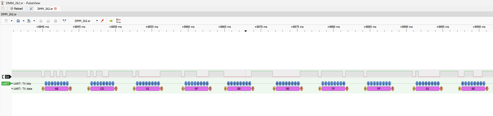

# DMM.sr Analysis

## Overview



This repository documents the analysis of the `DMM.sr` logic capture file obtained from a digital multimeter UART transmission. The capture was recorded using a logic analyzer and saved in **Sigrok session format (.sr)**. The goal of the analysis was to:

* Identify the communication protocol used by the multimeter
* Decode the UART data frames
* Extract measurement values in real time
* Reverse-engineer the frame structure
* Implement decoders for PC and ESP32

---

# Capture Information

| Parameter           | Value                   |
| ------------------- | ----------------------- |
| File                | `DMM.sr`                |
| Capture tool        | Sigrok / PulseView      |
| Capture type        | Digital logic analyzer  |
| Sample rate         | 80 kHz                  |
| Channels            | 26                      |
| Active signal       | UART TX from multimeter |
| Estimated baud rate | ~2400 baud              |
| UART format         | 8N1                     |
| Frame rate          | ~8–9 frames/sec         |

The multimeter continuously transmits measurement frames over UART.

---

# Frame Structure

Each frame contains **10 bytes**.

```
Byte 0  Header (0xAB)
Byte 1  Header (0xCD)
Byte 2  Device ID
Byte 3  Message type
Byte 4  Raw value MSB
Byte 5  Raw value LSB
Byte 6  Mode code MSB
Byte 7  Mode code LSB
Byte 8  Checksum / status
Byte 9  Checksum / status
```

Example frame captured:

```
AB CD 01 14 00 00 00 07 00 1C
```

---

# Measurement Decoding

Raw measurement value:

```
raw_value = (byte4 << 8) | byte5
```

Mode code:

```
mode_code = (byte6 << 8) | byte7
```

The final measurement depends on the scale defined by the mode/range.

```
reading = raw_value / scale
```

---

# Observed Mode Codes

From the capture analysis:

| Mode Code | Function   | Range  | Scale |
| --------- | ---------- | ------ | ----- |
| 0x0007    | DC Voltage | 20 V   | 100   |
| 0x0009    | DC Voltage | 200 V  | 10    |
| 0x0004    | Resistance | 20 kΩ  | 100   |
| 0x0005    | Resistance | 20 kΩ  | 100   |
| 0x0006    | Resistance | 20 kΩ  | 100   |
| 0x000A    | Resistance | 200 kΩ | 10    |
| 0x000B    | Resistance | 200 kΩ | 10    |

---

# Example Measurements

### Voltage measurement (9V battery)

Captured frame:

```
AB CD 01 14 03 CF 00 07 XX XX
```

Decoded:

```
raw = 975
scale = 100
voltage = 9.75 V
```

---

### Resistance measurement (2.2k resistor)

Captured frame:

```
AB CD 01 14 00 D9 00 04 XX XX
```

Decoded:

```
raw = 217
scale = 100
resistance = 2.17 kΩ
```

---

# Tools Created During Analysis

The analysis resulted in the following implementations:

## Python UART Decoder

Features:

* Real-time decoding
* CSV logging
* Mode detection
* Frame synchronization

## ESP32 Real-Time Decoder

Features:

* UART decoding
* WiFi web dashboard
* Live measurement display
* Works with ESP32 DevKit V1

---

# Web Dashboard

The ESP32 hosts a real-time monitoring dashboard accessible via:

```
http://ESP32_IP_ADDRESS
```

Displays:

* Current measurement
* Unit
* Mode
* Range

Updates every **500 ms**.

---

# Reverse Engineering Notes

Key observations from the capture:

1. The multimeter transmits data continuously.
2. Frames are synchronized using the header `AB CD`.
3. Measurement data is encoded as a scaled integer.
4. Mode codes change depending on dial position.
5. Frame timing matches typical DMM refresh intervals.

The protocol is consistent with multimeters using ADC controllers similar to the **DTM0660 family**.

---

# Future Improvements

Possible extensions for this project:

* Sigrok protocol decoder
* Auto-detection of all measurement modes
* Data logging server
* MQTT streaming
* OTA firmware updates
* Historical graphing dashboard

---

# Conclusion

The `DMM.sr` capture was successfully decoded, allowing extraction of real-time measurement data from the multimeter UART interface. The reverse-engineered protocol enabled building both software and embedded decoders for monitoring and logging measurements.
